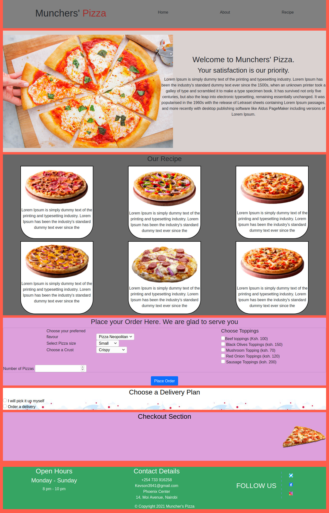

# Munchers' Pizza Website.
#### This is a Pizza ordering Website
#### By **Nyambura Kelvin Njuguna**

## Description.
This is a website for a pizza place where customers can learn more about the business, view the recipe, place an order and ask for delivery.

## Prototype.

## Setup/Installation Requirements.
* Install Google Chrome on your machine.
* click the live link i.e. open the live link using google chrome to view the Munchers' pizza website.
* Navigate the page by scrolling down.
* place your order in the order section and then click "place order" to submit.
* Go to the delivery opions section and select a delivery strategy.
* If you want us to deliver your order, enter the delivery location details in the form that appears and then click checkout.

## Live link.
https://kevson102.github.io/Phoenix-Foods/

[Demo](./Demo/Muncher's website Demo.mp4)
#
#
## Known Bugs
* THE INPUT FORMS ARE YET TO BE VALIDATED.

## BDD
1. The live link directs the user to the Munchers' pizza webpage.
2. The user can navigate the site by scrolling down.
3. The customer can select the flavour of the pizza they want.
4. The customer can select a crust for the pizza.
5. The user can select as many toppings as they would wish.
6. The user has the option to select a delivery strategy.
7. The user can enter the details of their prefered delivery location.
8. The user can see a summary of thier order in the checkout section after checking out their order.
9. After submission of the delivery form, the user gets a prompt informing them that their order has been dispatched and that they will receive a call on delivery.
## Technologies Used
1. HTML
2. CSS
3. JavaScript
4. jQuery
## Support and contact details
* Email: Kevson3941@gmail.com
* Phone no. +254 733 916258
### License
<a href="./LICENSE.MD" target = "_blank">MIT</a>

Copyright (c) 2021 **Muncher's Pizza-Nyambura Kelvin Njuguna**